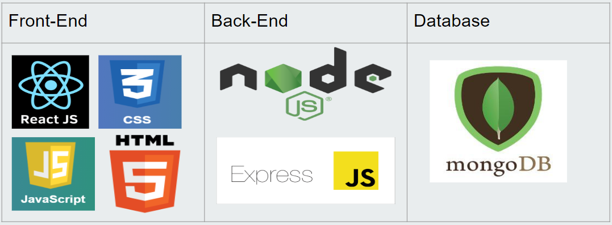

# Income-Expense Tracker
Web Application made during my Talentserve Software  Engineering Internship\
(June-July 2023)

This project was bootstrapped with [Create React App](https://github.com/facebook/create-react-app).

## Tech-Stack

## Available Scripts
Install the required libraries using npm for **Backend**.
### `npm install express cors mongoose nodemon`
Install the required libraries using npm for **Frontend**.
### `npm install axios chart.js react-datepicker` 
### `npm install react-chartjs-2 styled-components`

### Note- It is necessory to my Mongodb server to be connected at the time you are trying to run the application by above method otherwise there will be DB connection error. 

### Deploy your own MongoDb server using the site (https://cloud.mongodb.com/v2#/org/64c67d95e1db1064d0a99d7b/projects) 
### Then add the url with your own password to ./Backend/env file changing the MONGO_URL then run:

### In the project and its Backend directory , you can run:

### `npm start`
Runs the app in the development mode.\
Open [http://localhost:3000](http://localhost:3000) to view it in your browser.

